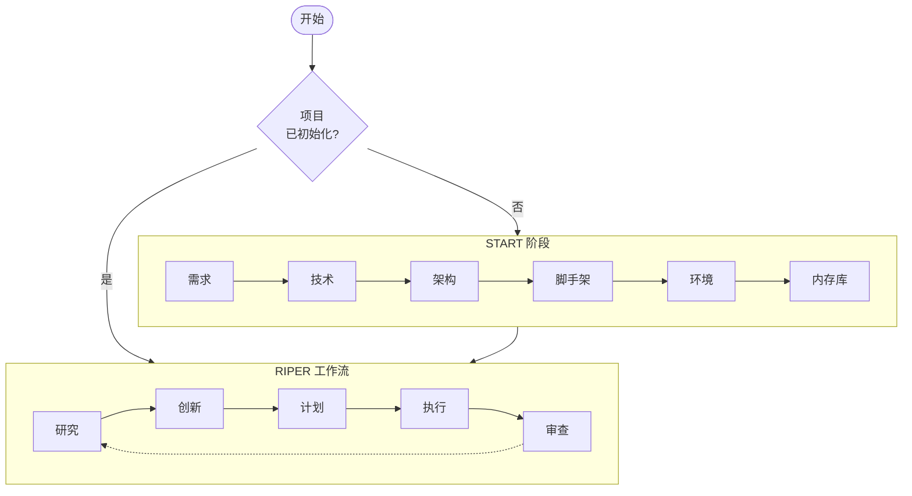
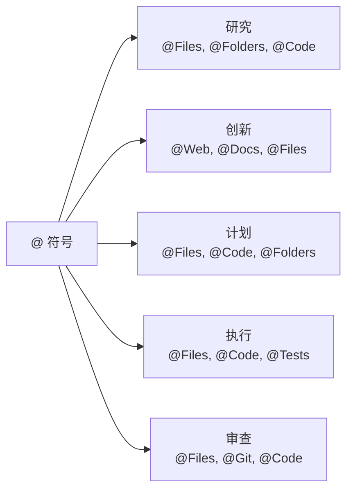

# CursorRIPER 框架

一个用于 [Cursor IDE](https://www.cursor.com/) 的 AI 辅助软件开发综合框架，结合了结构化工作流程和持久性记忆。

## 概述

CursorRIPER 通过五种不同的操作模式提供系统化的软件开发方法：

1. **Research（研究）**：收集信息和理解现有代码
2. **Innovate（创新）**：头脑风暴潜在方法和解决方案
3. **Plan（计划）**：创建详细的技术规范
4. **Execute（执行）**：精确实施已批准的计划
5. **Review（审查）**：根据计划验证实施

该框架防止意外修改，同时在编码会话之间保持完美的连续性。



## 特性

- **结构化工作流**：明确区分开发阶段
- **内存库**：跨会话的持久性文档
- **项目智能**：从模式和偏好中学习
- **状态管理**：明确跟踪项目阶段和模式
- **安全初始化**：引导设置，防止重新初始化
- **@ 符号集成**：通过 Cursor 的 @ 符号增强上下文引用

## 入门指南

1. 将框架文件复制到你的项目中并更改扩展名为 .mdc：
   ```bash
   cp -r /path/to/CursorRIPER/src/.cursor/* .cursor/
   rename 's/\.md$/.mdc/' *.md
   ```

2. 使用以下命令初始化项目：
   ```
   /start
   ```

3. 按照 START 阶段设置项目结构和内存库

4. 使用 RIPER 工作流进行持续开发

## @ 符号增强功能（v1.0.3 新增）

该框架现在与 Cursor IDE 强大的 @ 符号功能集成，提供增强的上下文引用：

- **模式特定符号**：针对每个 RIPER 模式优化的符号模式
- **符号注册表**：在内存库中跟踪重要的项目引用
- **渐进式引入**：在 START 阶段逐步引入符号
- **性能优化**：处理大文件和目录的指导
- **可定制**：在 customization.mdc 中配置符号偏好



## 文档

- [设置指南](docs/setup-guide-zh.md)
- [START 阶段指南](docs/start-phase-guide-zh.md)
- [RIPER 工作流指南](docs/riper-workflow-guide-zh.md)
- [内存库指南](docs/memory-bank-guide-zh.md)
- [自定义模式指南](docs/custom-modes-guide-zh.md)
- [故障排除指南](docs/troubleshooting-guide-zh.md)
- [@ 符号指南](docs/@-symbol-guide-zh.md)（新增）

## 许可证

该项目采用 MIT 许可证 - 详情见 LICENSE 文件。

---
原始 RIPER 框架作者：[robotlovehuman](https://github.com/robotlovehuman)

*CursorRIPER 框架在保持会话之间完美连续性的同时防止编码灾难。* 