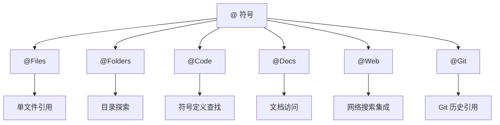
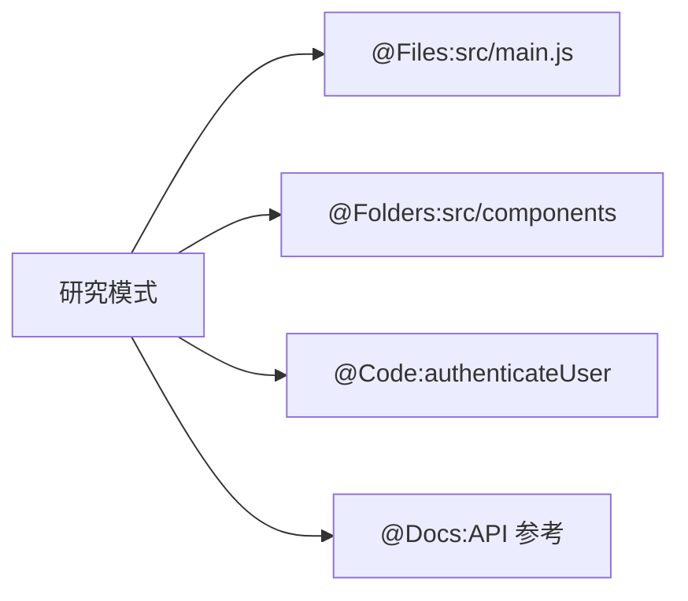
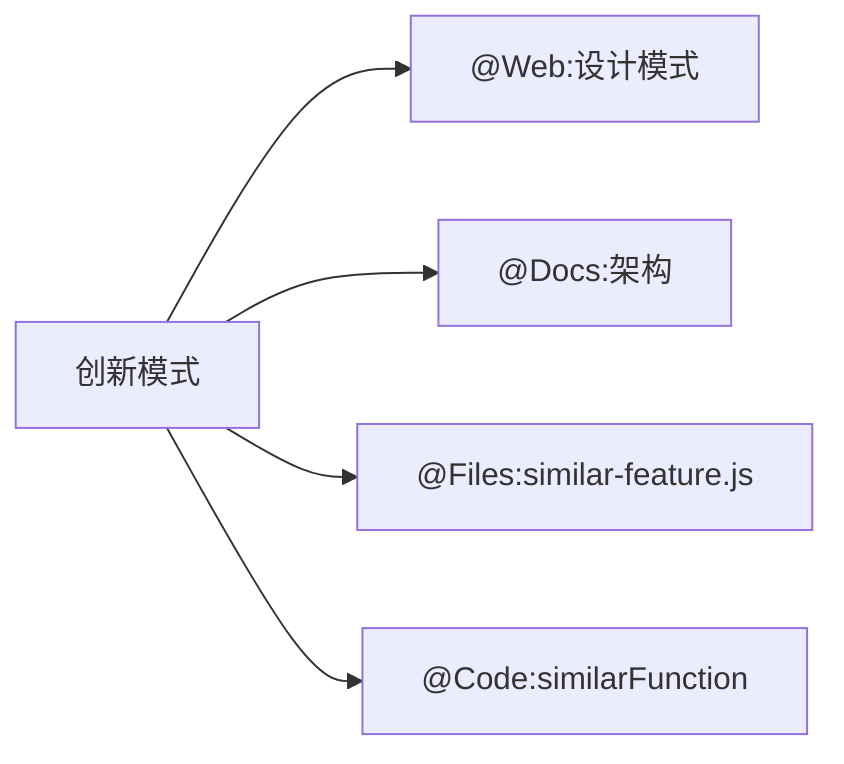
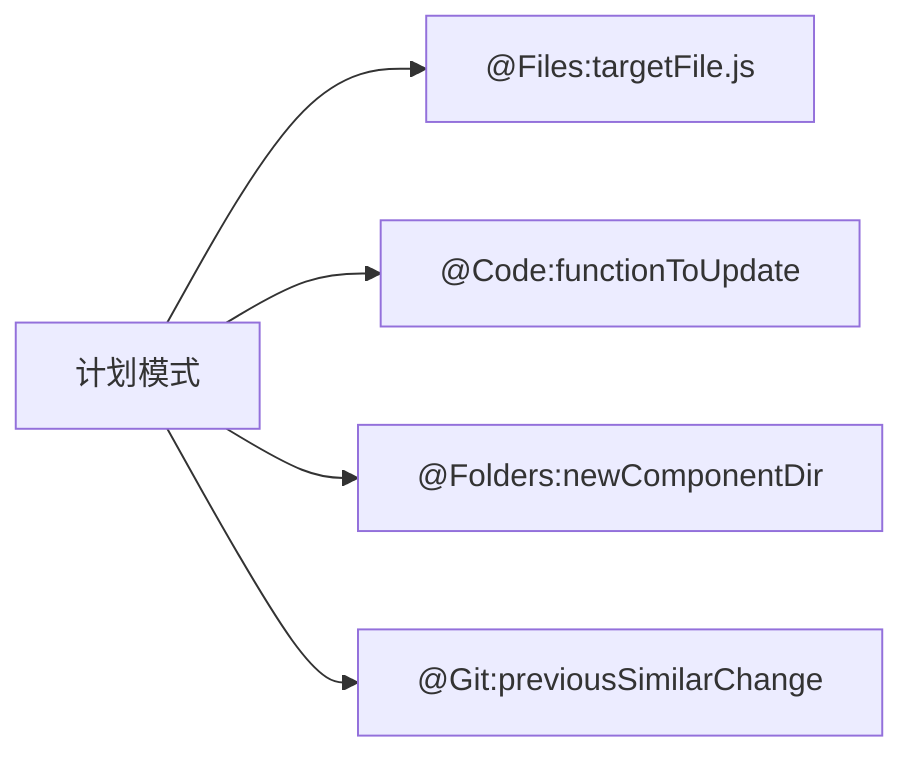
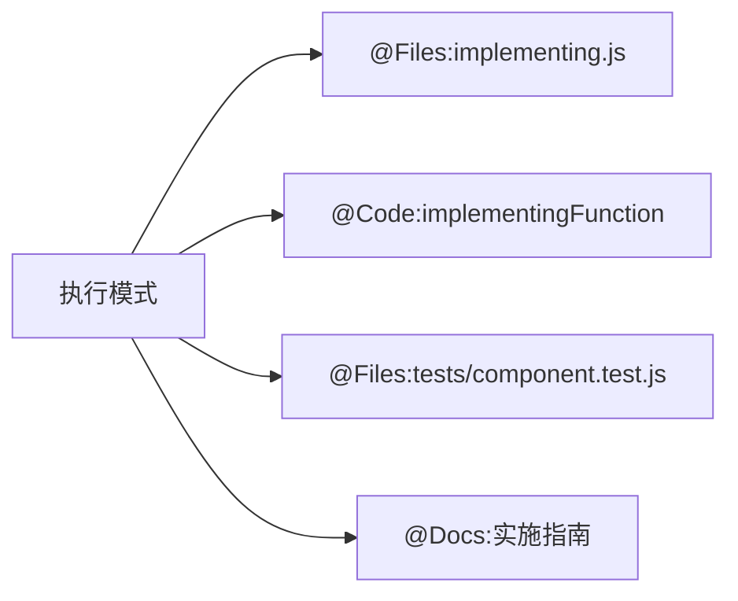
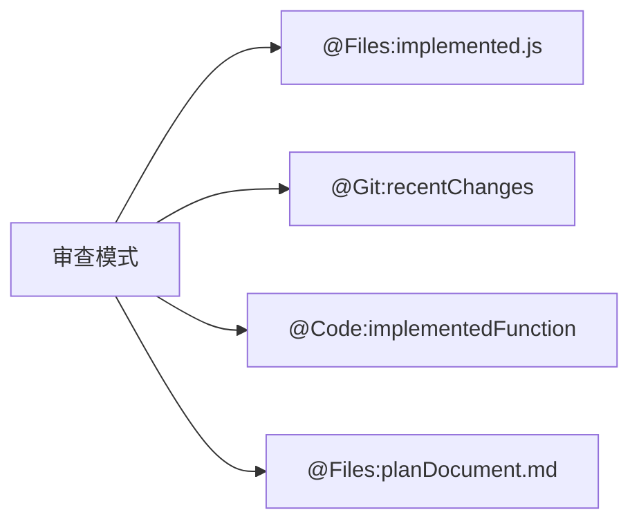

# CursorRIPER 框架 - @ 符号指南
*版本: 1.0*

## 概述

本指南说明如何在 CursorRIPER 框架中使用 Cursor IDE 的 @ 符号功能，以便在开发过程中高效地引用上下文。

## 什么是 @ 符号？

在 Cursor IDE 中，@ 符号提供了一种强大的方式来在与 AI 助手的对话中引用特定上下文：

- `@Files:path/to/file.js` - 引用特定文件
- `@Folders:path/to/directory` - 引用整个文件夹
- `@Code:functionName` - 引用特定代码符号
- `@Docs:topic` - 访问文档
- `@Web:query` - 研究外部信息
- `@Git:reference` - 访问 git 历史



## CursorRIPER 框架中的 @ 符号

CursorRIPER 框架在其整个工作流程中集成了 @ 符号，以增强上下文感知能力，同时保持结构化的 RIPER 方法。

### START 阶段的 @ 符号使用

在项目初始化期间，@ 符号有助于：

1. **需求收集**
   - 使用 `@Web:similar projects` 研究类似项目
   - 使用 `@Files:requirements.md` 引用需求文档

2. **技术选择**
   - 使用 `@Web:technology comparisons` 研究技术选项
   - 使用 `@Docs:framework` 访问文档

3. **架构定义**
   - 使用 `@Docs:architecture patterns` 引用架构模式
   - 使用 `@Folders:similar-project` 检查类似架构

4. **项目搭建**
   - 使用 `@Folders:src` 设置目录结构
   - 使用 `@Files:config.js` 创建配置文件

5. **环境设置**
   - 使用 `@Files:.env.example` 配置环境
   - 使用 `@Docs:testing` 引用测试设置

6. **内存库初始化**
   - 在 `@-symbol-registry.md` 中记录关键项目符号
   - 使用 `@Files:template.md` 引用内存库模板

### RIPER 工作流中的 @ 符号使用

每种 RIPER 模式都有特定的 @ 符号模式，可以提高其效率：

#### 研究 (RESEARCH) 模式
- **目的**：理解现有代码
- **关键符号**：`@Files`、`@Folders`、`@Code`、`@Docs`
- **示例**：`@Files:src/components/UserProfile.js`
- **策略**：使用符号系统地探索代码库



#### 创新 (INNOVATE) 模式
- **目的**：头脑风暴方法
- **关键符号**：`@Web`、`@Docs`、`@Files`（用于类似实现）
- **示例**：`@Web:latest authentication patterns`
- **策略**：使用符号研究选项并引用类似功能



#### 计划 (PLAN) 模式
- **目的**：创建详细规范
- **关键符号**：`@Files`、`@Code`、`@Folders`（针对实施目标）
- **示例**：`@Files:src/services/apiService.js`
- **策略**：使用符号精确指定实施目标



#### 执行 (EXECUTE) 模式
- **目的**：实施计划
- **关键符号**：`@Files`、`@Code`（实施目标）、`@Files`（测试文件）
- **示例**：`@Code:authenticateUser`
- **策略**：在实施时引用计划中的符号



#### 审查 (REVIEW) 模式
- **目的**：验证实施
- **关键符号**：`@Files`、`@Git`、`@Code`（已实施项目）
- **示例**：`@Git:recent-changes`
- **策略**：使用符号将已实施代码与计划进行比较



## 项目特定的 @ 符号注册表

CursorRIPER 框架包含一个专用的 @ 符号注册表在内存库中：

- **位置**：`memory-bank/@-symbol-registry.md`
- **目的**：记录项目的所有重要符号
- **更新**：在开发过程中维护
- **类别**：文件、文件夹、代码、文档、网络、Git
- **性能说明**：包括处理大文件/目录的指导

### 注册表示例

```markdown
## 关键文件
| 符号 | 描述 | 相关性 |
|--------|-------------|-----------|
| `@Files:src/main.js` | 应用程序入口点 | 高 |
| `@Files:src/components/Button.js` | 可重用按钮组件 | 中 |
| `@Files:config/routes.js` | 应用程序路由配置 | 高 |
```

## 将 @ 符号与内存库集成

CursorRIPER 框架的内存库文件通过 @ 符号引用得到增强：

1. **projectbrief.md**：带有相关研究符号的核心需求
2. **systemPatterns.md**：带有组件引用的架构文档
3. **techContext.md**：带有参考文档符号的技术堆栈
4. **activeContext.md**：带有活动文件/组件符号的当前焦点
5. **progress.md**：带有特定功能符号的实施跟踪
6. **@-symbol-registry.md**：所有项目符号的综合注册表

### 交叉引用示例

```markdown
# 活动上下文：用户身份验证
*当前 RIPER 模式：执行*

## 当前焦点
实施用户身份验证流程。

## 关键上下文引用
- `@Files:src/services/auth.js` - 身份验证服务实施
- `@Code:validateUserCredentials` - 凭证验证函数
- `@Folders:src/components/auth` - 身份验证相关组件
- `@Files:tests/services/auth.test.js` - 身份验证测试
```

## 最佳实践

### 符号发现
1. **递增探索**：在深入之前先从高级 `@Folders` 开始
2. **使用代码搜索**：使用代码库搜索查找相关符号
3. **边做边记录**：将重要符号添加到注册表
4. **链接相关符号**：将相关符号组合在一起

### 性能优化
1. **避免大文件**：对于 >1000 行的文件，使用 `@Code` 而不是 `@Files`
2. **针对特定子目录**：对于大型目录，针对特定子目录
3. **限制并发符号**：避免同时引用太多符号
4. **使用渐进式加载**：渐进式加载上下文而不是一次加载全部

### 内存库集成
1. **定期更新注册表**：保持符号注册表最新
2. **将符号链接到功能**：按功能区域组织符号
3. **注明符号相关性**：将符号标记为高/中/低相关性
4. **记录性能考虑因素**：注明哪些符号需要特殊处理

### 特定模式的最佳实践

1. **研究 (RESEARCH) 模式**
   - 在深入之前先从高级文件夹开始
   - 使用 `@Code` 精确定位特定功能
   - 在符号注册表中记录重要发现
   - 创建相关符号的逻辑分组

2. **创新 (INNOVATE) 模式**
   - 使用 `@Web` 研究现代方法
   - 使用 `@Files` 引用类似实现
   - 创建相关符号的启发性集合
   - 使用 `@Docs` 访问最佳实践

3. **计划 (PLAN) 模式**
   - 对文件路径和函数名称非常精确
   - 用符号映射所有实施目标
   - 在计划中包含测试文件路径
   - 引用文档以获取实施指导

4. **执行 (EXECUTE) 模式**
   - 遵循计划中指定的精确符号
   - 同时引用实施文件和测试文件
   - 使用 `@Docs` 获取实施指导
   - 通过基于符号的检查表项目跟踪进度

5. **审查 (REVIEW) 模式**
   - 将已实施文件与计划目标进行比较
   - 使用 `@Git` 审查最近更改
   - 与计划文档交叉引用
   - 使用精确的符号引用注明任何偏差

## @ 符号快速参考

| 符号类型 | 格式 | 示例 | 最适用于 |
|-------------|--------|---------|----------|
| 文件 | `@Files:path/to/file.ext` | `@Files:src/App.js` | 检查特定文件 |
| 文件夹 | `@Folders:path/to/dir` | `@Folders:src/components` | 理解结构 |
| 代码 | `@Code:symbolName` | `@Code:authenticateUser` | 特定函数/变量 |
| 文档 | `@Docs:topic` | `@Docs:react-hooks` | 框架文档 |
| 网络 | `@Web:query` | `@Web:modern auth patterns` | 外部研究 | 