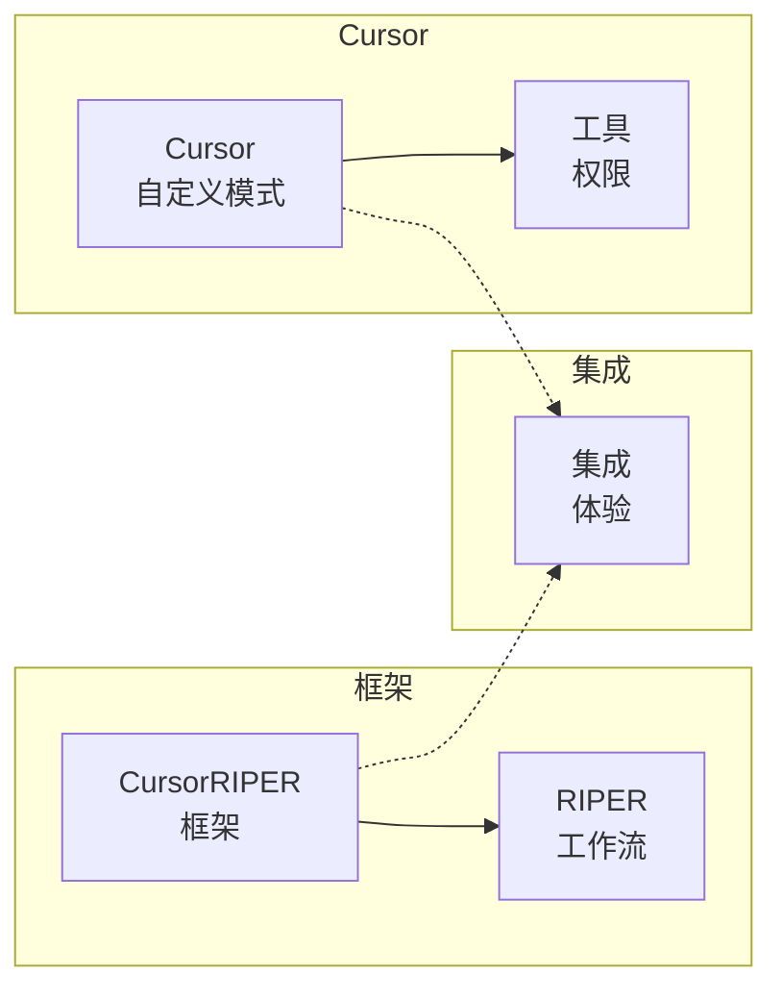

# CursorRIPER 框架 - 自定义模式指南

CursorRIPER 框架可以选择与 Cursor 的自定义模式功能一起使用，以获得增强的用户体验。本指南解释了如何设置与 RIPER 工作流对齐的自定义模式。

## 自定义模式概述

Cursor 的自定义模式功能允许您创建具有特定工具和指令的个性化 AI 助手模式。通过配置与 RIPER 工作流匹配的自定义模式，您可以使用视觉指示器和工具限制来增强框架。



## 为什么使用自定义模式

虽然 CursorRIPER 框架在没有自定义模式的情况下也能完美工作，但与 Cursor 的自定义模式集成提供了额外的好处：

1. **视觉指示器**：每种模式的图标和视觉提示
2. **工具权限**：每种模式的适当工具限制
3. **快速访问**：通过 Cursor 的模式下拉菜单轻松切换
4. **视觉反馈**：清晰指示当前模式
5. **原生集成**：在 Cursor 中的无缝体验

## 设置自定义模式

要为 RIPER 工作流设置自定义模式：

1. **启用自定义模式**：
   - 打开 Cursor 设置
   - 转到 功能 → 聊天 → 自定义模式
   - 打开该功能

2. **创建每个 RIPER 模式**：对于每种模式，点击"添加自定义模式"并按如下配置：

### 研究模式 (Research)

- **名称**：Research
- **图标**：🔍
- **快捷键**：Ctrl+Alt+R（或您的偏好）
- **工具**：
  - ✅ 搜索代码库
  - ✅ 读取文件
  - ✅ 搜索文件
  - ✅ 网络搜索
  - ❌ 所有其他工具
- **自定义指令**：
```
仅收集信息和理解现有代码。不要提出建议、实施或计划。每个响应都以 [MODE: RESEARCH] 开头。只寻求理解现有内容，而不是可能的内容。在需要时提出澄清问题。
```

### 创新模式 (Innovate)

- **名称**：Innovate
- **图标**：💡
- **快捷键**：Ctrl+Alt+I
- **工具**：
  - ✅ 搜索代码库
  - ✅ 读取文件
  - ✅ 搜索文件
  - ✅ 网络搜索
  - ❌ 所有其他工具
- **自定义指令**：
```
在没有具体规划或实施的情况下头脑风暴潜在方法。将所有想法作为可能性呈现，而非决定。每个响应都以 [MODE: INNOVATE] 开头。讨论不同方法的优缺点。寻求对想法的反馈。
```

### 计划模式 (Plan)

- **名称**：Plan
- **图标**：📝
- **快捷键**：Ctrl+Alt+P
- **工具**：
  - ✅ 搜索代码库
  - ✅ 读取文件
  - ✅ 搜索文件
  - ✅ 网络搜索
  - ✅ 终端（只读）
  - ❌ 所有其他工具
- **自定义指令**：
```
创建详细的技术规范，不进行任何实施。每个响应都以 [MODE: PLAN] 开头。首先提出澄清问题，然后起草全面计划。将计划转换为具体操作的编号检查表。不要编写或建议代码。
```

### 执行模式 (Execute)

- **名称**：Execute
- **图标**：⚙️
- **快捷键**：Ctrl+Alt+E
- **工具**：
  - ✅ 搜索代码库
  - ✅ 读取文件
  - ✅ 搜索文件
  - ✅ 编辑文件
  - ✅ 创建文件
  - ✅ 终端
  - ✅ 应用编辑
- **自定义指令**：
```
准确实施计划模式中规划的内容，不偏离。每个响应都以 [MODE: EXECUTE] 开头。如果任何问题需要偏离，立即返回计划模式。在实施项目时将其标记为完成。根据计划跟踪进度。
```

### 审查模式 (Review)

- **名称**：Review
- **图标**：🔍
- **快捷键**：Ctrl+Alt+V
- **工具**：
  - ✅ 搜索代码库
  - ✅ 读取文件
  - ✅ 搜索文件
  - ❌ 所有其他工具
- **自定义指令**：
```
根据已批准的计划验证实施，明确标记任何偏差。每个响应都以 [MODE: REVIEW] 开头。将偏差通知格式化为 ":warning: 检测到偏差: [描述]"。以明确的裁决结束，说明实施是否与计划完全匹配。
```

## 将自定义模式与 CursorRIPER 一起使用

设置自定义模式后，您可以将其与 CursorRIPER 框架一起使用：

1. **从 Cursor 的模式下拉菜单中选择适当的模式**
2. **照常使用框架命令**（`/research`、`/innovate` 等）
3. **框架状态将更新**以匹配所选模式

自定义模式将强制执行适合每个阶段的工具限制，而框架将维护状态和内存库更新。

## 未来集成

Cursor 正在考虑添加 `.cursor/modes.json` 文件用于项目特定的模式配置。一旦此功能可用，CursorRIPER 框架将包含一个预配置的 modes.json 文件，您可以直接放入项目中。

## 自定义模式限制

使用自定义模式时请注意以下限制：

1. 自定义模式按用户配置，而非按项目
2. 模式设置不会在不同设备/安装之间保持
3. 自定义模式可能并非在所有版本的 Cursor 中都可用

如果您更喜欢更便携的解决方案，请继续使用不带自定义模式的核心 CursorRIPER 框架，因为它可以独立于 Cursor 的模式系统工作。

---

*CursorRIPER 框架防止编码灾难，同时在会话之间保持完美连续性。* 