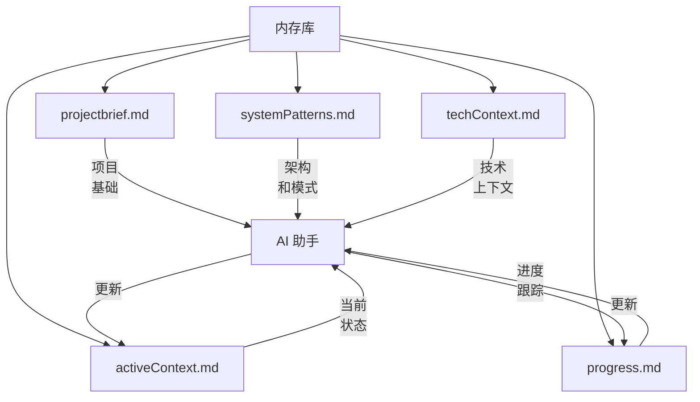

# CursorRIPER 框架 - 内存库指南

内存库 (Memory Bank) 是 CursorRIPER 框架的核心组件，在编码会话之间提供持久上下文。本指南解释了如何有效使用和维护您的内存库。

## 内存库概述



## 核心内存文件

### projectbrief.md

**目的**：定义项目的核心需求和目标。

**关键部分**：
- 项目概述
- 核心需求
- 成功标准
- 范围（包括/排除）
- 时间表
- 利益相关者

**何时更新**：
- 在项目开始时
- 当主要需求变更时
- 当项目范围演变时

### systemPatterns.md

**目的**：记录系统架构和设计模式。

**关键部分**：
- 架构概述
- 关键组件
- 使用中的设计模式
- 数据流
- 关键技术决策
- 组件关系

**何时更新**：
- 架构决策后
- 建立新模式时
- 组件关系改变时

### techContext.md

**目的**：描述使用的技术和开发设置。

**关键部分**：
- 技术栈
- 开发环境设置
- 依赖项
- 技术约束
- 构建和部署
- 测试方法

**何时更新**：
- 添加新技术时
- 更新依赖项后
- 更改构建流程时
- 修改开发环境时

### activeContext.md

**目的**：跟踪当前工作重点和即时下一步。

**关键部分**：
- 当前焦点
- 最近变更
- 活跃决策
- 下一步
- 当前挑战
- 实施进度

**何时更新**：
- 每个工作会话开始时
- 完成重要任务后
- 切换焦点区域时
- 遇到新挑战时

### progress.md

**目的**：跟踪已完成、进行中和待构建的内容。

**关键部分**：
- 项目状态
- 已完成功能
- 进行中的工作
- 待构建内容
- 已知问题
- 里程碑

**何时更新**：
- 完成功能后
- 开始新工作时
- 发现问题时
- 达到里程碑时

## 内存库管理

### 自动更新

框架可以根据您的自定义设置自动更新内存文件：

- `AUTO_UPDATE_MEMORY`：控制是否启用自动更新
- `MEMORY_UPDATE_FREQUENCY`：控制更新发生的时间

### 手动更新

您可以通过以下方式手动更新内存文件：

1. 直接编辑文件
2. 请求 AI 更新特定文件
3. 使用内存库更新命令

示例：
```
请更新 progress.md 文件以反映我们已完成用户身份验证功能。
```

### 内存库最佳实践

1. **保持信息更新**
   - 定期更新 activeContext.md 和 progress.md
   - 确保技术决策记录在 systemPatterns.md 中
   - 随着需求演变更新 projectbrief.md

2. **使用一致的格式**
   - 遵循每种文件类型的模板
   - 一致使用 markdown 格式
   - 为所有更新包含日期

3. **在更新中具体说明**
   - 包括特定的文件路径、函数名和组件名
   - 使用详细描述记录问题
   - 链接文件之间的相关项目

4. **维护版本历史**
   - 在内存文件中包含版本号
   - 更改时更新"最后更新"时间戳
   - 跟踪主要修订

5. **逻辑组织信息**
   - 使用明确的章节标题
   - 将相关信息组合在一起
   - 对属于一起的项目使用列表

## 内存库和 RIPER 工作流

每种 RIPER 模式以特定方式与内存库交互：

### 研究 (RESEARCH) 模式
- 读取：projectbrief.md、systemPatterns.md、techContext.md
- 更新：activeContext.md 添加新发现

### 创新 (INNOVATE) 模式
- 读取：所有内存文件
- 更新：systemPatterns.md 添加设计替代方案和决策

### 计划 (PLAN) 模式
- 读取：所有内存文件
- 更新：activeContext.md 添加计划的更改，progress.md 添加预期结果

### 执行 (EXECUTE) 模式
- 读取：所有内存文件
- 更新：activeContext.md 添加进度，progress.md 添加已完成项目

### 审查 (REVIEW) 模式
- 读取：所有内存文件
- 更新：progress.md 添加审查发现，activeContext.md 添加审查状态

## 故障排除

如果您遇到内存库问题：

1. **信息缺失**
   - 检查内存库目录中是否存在文件
   - 验证文件权限
   - 如有必要，重新运行内存库初始化

2. **过时信息**
   - 更新时间戳和版本号
   - 审查并更新所有相关部分的内容
   - 考虑完全刷新内存库

3. **信息不一致**
   - 交叉引用内存文件
   - 更改时更新所有相关文件
   - 请求 AI 帮助协调不一致

4. **文件损坏**
   - 从备份恢复
   - 如有必要，从模板重新生成文件
   - 请求 AI 帮助重建缺失信息

---

*CursorRIPER 框架防止编码灾难，同时在会话之间保持完美连续性。* 