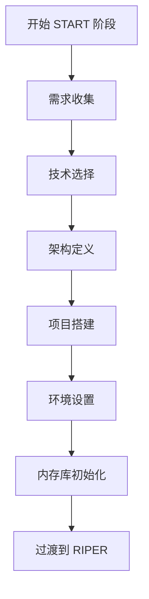

# CursorRIPER 框架 - START 阶段指南

START 阶段是一次性初始化过程，用于设置您的项目和内存库。本指南解释了如何完成 START 阶段的每个步骤。

## START 阶段概述



## 启动 START 阶段

要开始 START 阶段，请在 Cursor IDE 聊天中使用以下命令之一：

```
/start
```

或

```
BEGIN START PHASE
```

## 步骤 1：需求收集

在此步骤中，AI 将通过提出关键问题来帮助您记录项目需求：

- 这个项目试图解决什么问题？
- 谁是主要用户或利益相关者？
- 必须具备的功能有哪些？
- 有哪些锦上添花的功能？
- 技术约束是什么？
- 完成的时间表是什么？

### 需求收集技巧

1. 尽可能具体地描述您的项目目标
2. 将功能优先级分为必须具备和锦上添花类别
3. 考虑用户角色及其需求
4. 尽早考虑技术约束
5. 设定现实的时间表预期

### 输出

在此步骤中收集的信息将用于在您的内存库中创建 `projectbrief.md`。

## 步骤 2：技术选择

AI 将通过询问以下问题帮助您选择适合项目的技术：

- 哪些编程语言最适合这个项目？
- 哪些框架或库最合适？
- 应该使用什么数据库技术？
- 目标部署环境是什么？
- 是否有特定的性能要求？
- 应该使用什么测试框架？

### 技术选择技巧

1. 考虑您的团队对不同技术的专业知识
2. 评估每个选项的长期支持和社区
3. 选择与项目规模和复杂性相符的技术
4. 考虑与现有系统的集成
5. 思考托管和部署要求

### 输出

技术决策将记录在 `techContext.md` 中。

## 步骤 3：架构定义

AI 将通过询问以下问题帮助您定义系统架构：

- 什么架构模式最合适？
- 应用程序将如何结构化？
- 主要组件及其职责是什么？
- 数据将如何在系统中流动？
- 系统将如何扩展？
- 需要解决哪些安全考虑？

### 架构定义技巧

1. 绘制图表以可视化组件关系
2. 明确定义组件之间的边界
3. 从一开始就计划可扩展性
4. 在架构层面考虑安全性
5. 记录关键架构决策及其理由

### 输出

架构将记录在 `systemPatterns.md` 中。

## 步骤 4：项目搭建

AI 将帮助您设置初始项目结构：

- 创建基本文件夹结构
- 初始化 git 仓库
- 设置包管理
- 创建初始配置文件
- 设置基本构建过程

### 项目搭建技巧

1. 遵循所选技术的行业标准项目结构
2. 从一开始就正确设置 .gitignore
3. 尽早配置代码检查和格式化工具
4. 创建具有清晰设置说明的 README.md
5. 考虑使用模板处理常见文件

## 步骤 5：环境设置

AI 将帮助您配置开发环境：

- 设置本地开发环境
- 配置测试框架
- 创建初始测试用例
- 定义 CI/CD 流水线
- 记录部署过程

### 环境设置技巧

1. 使用容器化确保环境一致性
2. 从一开始就设置自动化测试
3. 记录环境变量
4. 尽早配置 CI/CD 流水线
5. 创建开发、暂存和生产配置

## 步骤 6：内存库初始化

AI 将创建并填充所有核心内存文件：

- `projectbrief.md`（如果尚未创建）
- `systemPatterns.md`（如果尚未创建）
- `techContext.md`（如果尚未创建）
- `activeContext.md`
- `progress.md`

### 内存库初始化技巧

1. 检查所有内存文件的准确性
2. 在需要的地方添加额外细节
3. 确保适当填写所有部分
4. 设定现实的初始进度指标
5. 在 activeContext.md 中定义明确的下一步

## 过渡到 RIPER 工作流

完成所有六个步骤后，框架将：

1. 验证所有内存文件是否正确创建和填充
2. 更新状态，从 INITIALIZING 过渡到 DEVELOPMENT
3. 归档 START 阶段
4. 自动过渡到 RESEARCH 模式
5. 通知您项目初始化已完成

然后，您可以开始为开发过程使用 RIPER 工作流。

---

*CursorRIPER 框架防止编码灾难，同时在会话之间保持完美连续性。* 