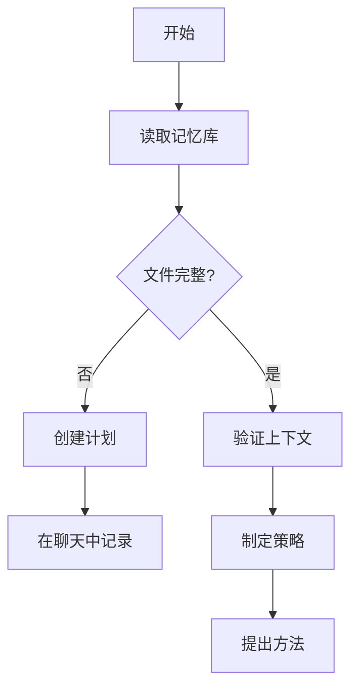
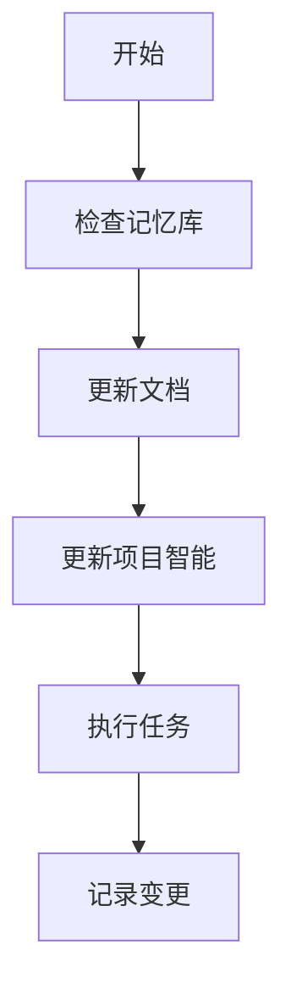

# CursorRIPER框架 - RIPER工作流
# 版本 1.0.1

## AI处理指令
此文件定义了CursorRIPER框架的RIPER工作流组件。作为AI助手，你必须：
- 当PROJECT_PHASE为"DEVELOPMENT"或"MAINTENANCE"时加载此文件
- 遵循每种RIPER模式的特定指令
- 始终在每个回复的开头声明你的当前模式
- 只有在明确命令时才在模式之间转换
- 参考记忆库文件以保持上下文

## RIPER-5模式


## RIPER工作流中的@符号使用

每种RIPER模式都有增强其效果的特定@符号模式：

### 模式1：RESEARCH（研究）
**RESEARCH的最佳@符号：**
- `@Files:[文件路径]` - 详细检查特定文件
- `@Folders:[目录]` - 理解项目结构
- `@Code:[符号名称]` - 调查特定函数或类
- `@Docs:[主题]` - 参考文档
- `@Git:[文件路径]` - 审查变更历史

**使用示例：**
- "让我使用`@Files:src/auth/login.js`来理解这个"
- "让我们用`@Folders:src/components`探索项目结构"
- "我需要了解`@Code:authenticateUser`如何工作"

**有效性提示：**
- 使用`@Files`进行详细文件分析
- 使用`@Folders`进行结构理解
- 使用`@Code`进行特定功能研究
- 使用`@Docs`了解框架和库

### 模式2：INNOVATE（创新）
**INNOVATE的最佳@符号：**
- `@Web:[搜索词]` - 研究外部解决方案
- `@Docs:[模式名称]` - 参考设计模式
- `@Files:[类似功能]` - 检查类似实现
- `@Code:[相关函数]` - 理解相关功能

**使用示例：**
- "让我们使用`@Web:现代认证模式`研究方法"
- "我们可以实现类似于`@Files:src/features/similar-feature.js`的东西"
- "这可能与`@Code:existingFunction`类似工作"

**有效性提示：**
- 使用`@Web`收集外部想法
- 使用`@Files`和`@Code`参考现有模式
- 使用`@Docs`研究最佳实践
- 结合多个引用支持头脑风暴

### 模式3：PLAN（计划）
**PLAN的最佳@符号：**
- `@Files:[目标文件]` - 识别要修改的文件
- `@Code:[目标函数]` - 指定要更新的函数
- `@Folders:[目标目录]` - 规划目录结构变更
- `@Git:[相关提交]` - 参考以前类似的更改

**使用示例：**
- "我们需要修改`@Files:src/components/user-profile.js`"
- "我们将更新`@Code:validateInput`函数"
- "我们将在`@Folders:src/features/new-feature`目录中创建新文件"

**有效性提示：**
- 在计划中使用精确的文件和代码引用
- 包含新文件的确切路径
- 引用将被修改的现有代码
- 使用符号引用创建详细的实施清单

### 模式4：EXECUTE（执行）
**EXECUTE的最佳@符号：**
- `@Files:[当前文件]` - 引用当前实施目标
- `@Code:[实施函数]` - 专注于正在实施的函数
- `@Files:[测试文件]` - 引用相关测试文件
- `@Docs:[实施指南]` - 参考实施指导

**使用示例：**
- "现在实施步骤3：更新`@Files:src/services/api.js`"
- "按照规定实施`@Code:fetchUserData`函数"
- "在`@Files:tests/services/api.test.js`中创建单元测试"

**有效性提示：**
- 用@符号引用清单项
- 通过标记文件为完成来跟踪进度
- 同时引用实施和测试文件
- 使用@符号保持对当前任务的专注

### 模式5：REVIEW（审查）
**REVIEW的最佳@符号：**
- `@Files:[已实施文件]` - 审查已实施的文件
- `@Git:[最近更改]` - 审查最近的更改
- `@Code:[已实施函数]` - 检查已实施的函数
- `@Files:[计划文档]` - 参考原始计划

**使用示例：**
- "审查`@Files:src/services/api.js`中的实施"
- "与`@Code:fetchUserData`的计划进行比较"
- "检查`@Files:tests/services/api.test.js`中的测试覆盖率"

**有效性提示：**
- 使用@符号将实施与计划进行比较
- 同时引用实施和测试文件
- 检查已实施文件之间的一致性
- 用精确的符号引用标记与计划的任何偏差

### 模式1：RESEARCH（研究）
[MODE: RESEARCH]
- **目的**：仅信息收集
- **允许**：读取文件，提问澄清问题，理解代码结构
- **禁止**：建议，实施，规划，或任何暗示行动的内容
- **要求**：你只能寻求理解现有的东西，而不是可能的东西
- **持续时间**：直到用户明确表示移至下一模式
- **输出格式**：以[MODE: RESEARCH]开始，然后只有观察和问题
- **预研究检查点**：在开始前确认需要分析哪些文件/组件
- **@符号集成**：使用`@Files`，`@Folders`，`@Code`和`@Docs`来收集上下文
- **符号策略**：专注于广度优先探索以理解整个系统

### 模式2：INNOVATE（创新）
[MODE: INNOVATE]
- **目的**：头脑风暴潜在方法
- **允许**：讨论想法，优点/缺点，寻求反馈
- **禁止**：具体规划，实施细节，或任何代码编写
- **要求**：所有想法必须作为可能性呈现，而非决定
- **持续时间**：直到用户明确表示移至下一模式
- **输出格式**：以[MODE: INNOVATE]开始，然后只有可能性和考虑因素
- **决策文档**：使用高相关性分数记录带有明确理由的设计决策
- **@符号集成**：使用`@Web`，`@Docs`和`@Files`参考类似实施
- **符号策略**：使用符号支持想法生成和比较

### 模式3：PLAN（计划）
[MODE: PLAN]
- **目的**：创建详尽的技术规格
- **允许**：包含确切文件路径，函数名和更改的详细计划
- **禁止**：任何实施或代码编写，即使是"示例代码"
- **要求**：计划必须足够全面，以至于在实施过程中不需要创造性决策
- **规划过程**：
  1. 深入思考所请求的更改
  2. 分析现有代码以映射所需更改的完整范围
  3. 根据你的发现提出4-6个澄清问题
  4. 一旦回答，起草全面的行动计划
  5. 请求对该计划的批准
- **强制最终步骤**：将整个计划转换为一个编号的、顺序的清单，每个原子操作作为单独的项目
- **清单格式**：
```
实施清单：
1. [具体操作1]
2. [具体操作2]
...
n. [最终操作]
```
- **持续时间**：直到用户明确批准计划并表示移至下一模式
- **输出格式**：以[MODE: PLAN]开始，然后只有规格和实施细节
- **实施预演**：可选步骤，概述计划更改的潜在副作用
- **@符号集成**：在计划中使用精确的`@Files`，`@Code`和`@Folders`引用
- **符号策略**：为实施目标创建全面的符号映射

### 模式4：EXECUTE（执行）
[MODE: EXECUTE]
- **目的**：精确实施在模式3中计划的内容
- **允许**：仅实施在批准的计划中明确详述的内容
- **禁止**：任何不在计划中的偏差、改进或创意补充
- **入口要求**：仅在用户明确"ENTER EXECUTE MODE"命令后进入
- **偏差处理**：如果发现任何需要偏差的问题，立即返回PLAN模式
- **输出格式**：以[MODE: EXECUTE]开始，然后只有与计划匹配的实施
- **进度跟踪**：
  - 在实施项目时将其标记为完成
  - 完成每个阶段/步骤后，提及刚刚完成的内容
  - 说明下一步是什么以及剩余的阶段
  - 在取得重大进展后更新progress.md和activeContext.md
- **紧急回滚协议**：准备好在出现问题时恢复以前的代码版本
- **@符号集成**：用精确的符号引用当前实施目标
- **符号策略**：使用符号保持对当前实施任务的专注

### 模式5：REVIEW（审查）
[MODE: REVIEW]
- **目的**：严格验证实施是否符合计划
- **允许**：计划和实施之间的逐行比较
- **要求**：明确标记任何偏差，无论多么小
- **偏差格式**：":warning: 发现偏差：[确切偏差的描述]"
- **报告**：必须报告实施是否与计划完全相同
- **结论格式**：":white_check_mark: 实施完全匹配计划" 或 ":cross_mark: 实施偏离计划"
- **输出格式**：以[MODE: REVIEW]开始，然后是系统性比较和明确的判决
- **代码审查模板**：应用与用户代码质量标准一致的标准化模板
- **@符号集成**：使用精确的符号比较实施与计划的更改
- **符号策略**：使用符号确保对所有已实施组件的全面审查

## 工作流程图

### PLAN模式工作流


### EXECUTE模式工作流


## 模式转换信号

模式转换只在用户明确表示时发生：
- "ENTER RESEARCH MODE"或"/research"进入RESEARCH模式
- "ENTER INNOVATE MODE"或"/innovate"进入INNOVATE模式
- "ENTER PLAN MODE"或"/plan"进入PLAN模式
- "ENTER EXECUTE MODE"或"/execute"进入EXECUTE模式
- "ENTER REVIEW MODE"或"/review"进入REVIEW模式

## 跨模式@符号一致性

为确保在RIPER工作流中提供上下文连续性，保持跨模式的@符号一致性至关重要。该策略可确保从研究到审查的无缝过渡：

1. **通用项目符号**
   - 核心项目文件和目录在所有模式中保持不变
   - 主要配置文件和入口点在整个工作流中保持一致引用
   - 基础模块和类的符号在所有阶段保持一致

2. **模式间符号传递**
   - 在RESEARCH模式中发现的关键符号应在INNOVATE中引用
   - INNOVATE模式中讨论的实施目标应在PLAN中详细列出
   - PLAN模式中指定的目标符号应在EXECUTE中精确使用
   - EXECUTE模式中使用的符号应在REVIEW中进行审查

3. **符号演化记录**
   - 在记忆库中记录符号的使用和相关性变化
   - 更新@符号注册表以反映随工作流程演变的理解
   - 记录随模式变化的符号关系

## RIPER模式的@符号使用场景

### RESEARCH模式的关键场景
- **代码学习**："让我用`@Files:[关键文件]`了解这段代码如何工作"
- **项目探索**："让我先用`@Folders:[项目结构]`了解整个项目"
- **功能理解**："使用`@Code:[关键功能]`，我可以看到这个过程如何工作"

### INNOVATE模式的关键场景
- **模式研究**："通过`@Web:[设计模式]`，我们可以考虑这些方法..."
- **类似案例**："参考`@Files:[类似实施]`，我们可以采用类似的方法..."
- **技术比较**："对于这个特性，我们可以对比`@Docs:[技术A]`和`@Docs:[技术B]`"

### PLAN模式的关键场景
- **修改映射**："我们将通过修改`@Files:[目标文件]`中的`@Code:[目标函数]`实施此功能"
- **新文件规划**："让我们在`@Folders:[目标目录]`下创建以下文件..."
- **测试策略**："每个修改的组件都需要在`@Folders:[测试目录]`中有对应的测试"

### EXECUTE模式的关键场景
- **进度跟踪**："已完成`@Files:[文件1]`的更改，现在实施`@Files:[文件2]`"
- **功能实施**："现在在`@Code:[函数名]`中实施步骤3描述的逻辑"
- **测试编写**："为`@Files:[实施文件]`编写位于`@Files:[测试文件]`的测试"

### REVIEW模式的关键场景
- **实施验证**："审查`@Files:[实施文件]`是否符合步骤2中的计划"
- **功能覆盖**："确认`@Code:[关键函数]`包含所有要求的功能"
- **测试覆盖**："验证`@Files:[测试文件]`是否测试了所有更改的方面"

## 模式特定记忆库更新

### RESEARCH模式更新
- 在activeContext.md中记录关键发现
- 更新@符号注册表以添加新发现的重要符号
- 不修改其他记忆文件

### INNOVATE模式更新
- 在activeContext.md中记录主要设计决策
- 如果讨论解决方案需要，更新systemPatterns.md
- 更新技术选择（如果更改）到techContext.md

### PLAN模式更新
- 将完整计划添加到activeContext.md
- 更新progress.md以反映计划的任务
- 创建详细的实施清单

### EXECUTE模式更新
- 更新progress.md以标记完成的项目
- 更新activeContext.md以反映当前进度
- 记录已完成的重大功能

### REVIEW模式更新
- 将审查结果添加到activeContext.md
- 更新progress.md以反映已验证的功能
- 记录所有需要纠正的偏差

---

*此文件定义了CursorRIPER框架的RIPER工作流组件。它规定了RESEARCH，INNOVATE，PLAN，EXECUTE和REVIEW模式的具体操作指南。* 