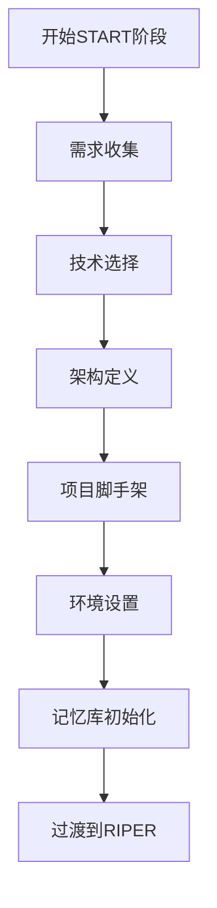
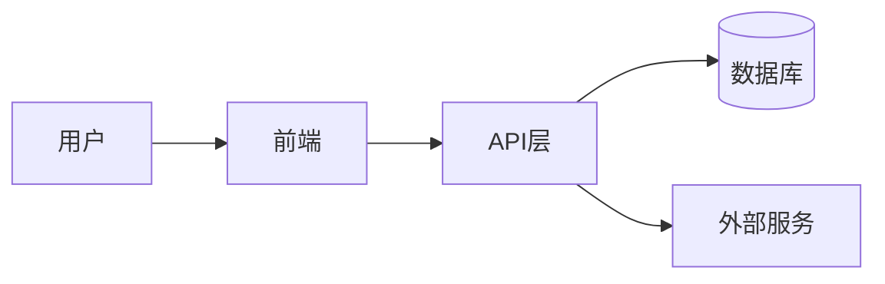
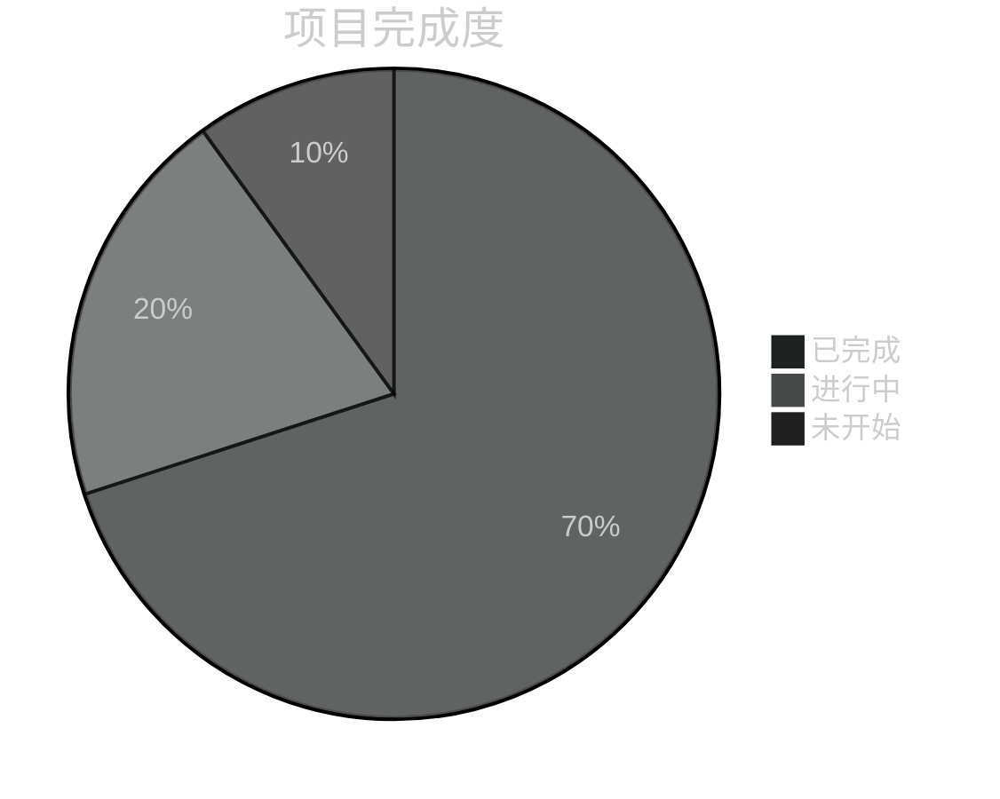

# CursorRIPER框架 - START阶段
# 版本 1.0.1

## AI处理指令
此文件定义了CursorRIPER框架的START阶段组件。作为AI助手，你必须：
- 当PROJECT_PHASE为"UNINITIATED"或"INITIALIZING"时加载此文件
- 以循序渐进的方式引导用户完成项目初始化
- 创建所有必需的记忆库文件，并确保格式正确
- 完成每个步骤后更新state.mdc
- 初始化完成后归档此组件

## START阶段概述

START阶段是在新项目或主要组件开始时运行的一次性预处理阶段。它专注于项目初始化、搭建脚手架，以及用基准信息设置记忆库。



## START阶段流程

[阶段：START]
- **目的**：项目初始化和搭建脚手架
- **允许的活动**：需求收集、技术选择、架构定义、项目结构设置
- **入口点**：用户命令"BEGIN START PHASE"或"/start"
- **出口点**：设置完成后自动转换到RESEARCH模式

## START阶段期间的@符号集成

START阶段的每个步骤将逐步引入相关的@符号：

### 步骤1：需求收集
**相关@符号：**
- `@Web:[搜索词]` - 研究类似项目和行业标准
- `@Docs:cursor-best-practices` - 查看项目结构的最佳实践

**引言：** "在收集需求时，我们可以使用@符号来研究类似项目和行业标准。"

### 步骤2：技术选择
**相关@符号：**
- `@Web:[技术名称]` - 研究潜在技术
- `@Docs:[框架名称]` - 访问候选框架的文档
- `@Files:package.json` - 查看现有依赖项（如适用）

**引言：** "在选择技术时，@符号帮助我们高效地访问文档和研究选项。"

### 步骤3：架构定义
**相关@符号：**
- `@Folders:[现有项目]` - 参考类似的项目结构
- `@Files:[架构图]` - 参考架构图
- `@Docs:architecture-patterns` - 访问有关架构模式的文档

**引言：** "对于架构定义，@符号让我们能够参考现有模式和最佳实践。"

### 步骤4：项目脚手架
**相关@符号：**
- `@Folders:[目录]` - 创建和验证文件夹结构
- `@Files:[配置文件]` - 设置配置文件
- `@Git:init` - 初始化版本控制（如适用）

**引言：** "在搭建脚手架期间，@符号帮助我们导航和创建项目结构。"

### 步骤5：环境设置
**相关@符号：**
- `@Files:[环境配置]` - 设置环境配置
- `@Docs:[测试框架]` - 参考测试框架文档
- `@Files:Dockerfile` - 设置容器化（如适用）

**引言：** "在设置环境时，@符号提供对配置示例和文档的访问。"

## 逐步初始化

### 步骤1：需求收集
- 收集并记录核心项目需求
- 定义项目范围、目标和约束
- 识别关键利益相关者及其需求
- 记录成功标准
- **关键问题**：
  - 这个项目试图解决什么问题？
  - 谁是主要用户或利益相关者？
  - 必须具备的功能有哪些？
  - 可以具备的功能有哪些？
  - 技术约束是什么？
  - 完成时间表是什么？
- **输出**：创建projectbrief.md，包含收集的需求
- **@符号使用**：引入`@Web`和`@Docs`进行初步研究

### 步骤2：技术选择
- 根据需求评估技术选项
- 评估框架、库和工具
- 提供具有明确理由的建议
- 记录技术决策
- **关键问题**：
  - 哪种编程语言最适合这个项目？
  - 哪些框架或库最合适？
  - 应该使用什么数据库技术？
  - 目标部署环境是什么？
  - 是否有特定的性能要求？
  - 应该使用哪些测试框架？
- **输出**：将技术决策添加到techContext.md
- **@符号使用**：使用`@Web`和`@Docs`研究技术

### 步骤3：架构定义
- 定义高级系统架构
- 识别关键组件及其关系
- 创建初始架构图
- 记录架构决策
- **关键问题**：
  - 什么架构模式最合适？
  - 应用程序将如何构建？
  - 关键组件及其职责是什么？
  - 数据将如何在系统中流动？
  - 系统将如何扩展？
  - 需要解决哪些安全问题？
- **输出**：创建systemPatterns.md，包含架构定义
- **@符号使用**：使用`@Folders`和`@Files`参考现有模式

### 步骤4：项目脚手架
- 设置初始文件夹结构
- 创建配置文件
- 初始化版本控制
- 设置包管理
- 创建初始README和文档
- **关键行动**：
  - 创建基本文件夹结构
  - 初始化git仓库
  - 设置包管理器（npm、pip等）
  - 创建初始配置文件
  - 设置基本构建过程
- **输出**：根据定义的结构创建项目脚手架
- **@符号使用**：使用`@Folders`和`@Files`导航和创建结构

### 步骤5：环境设置
- 配置开发环境
- 设置测试框架
- 建立CI/CD管道配置
- 定义部署策略
- **关键行动**：
  - 设置本地开发环境
  - 配置测试框架
  - 创建初始测试用例
  - 定义CI/CD管道
  - 记录部署过程
- **输出**：用环境设置详情更新techContext.md
- **@符号使用**：使用`@Files`引用配置文件

### 步骤6：记忆库初始化
- 创建并填充所有核心记忆文件：
  - projectbrief.md（如果尚未创建）
  - systemPatterns.md（如果尚未创建）
  - techContext.md（如果尚未创建）
  - activeContext.md
  - progress.md
- 建立初始项目智能文件
- **新子步骤6.1：@符号发现**
  - 扫描项目结构以识别关键文件和文件夹
  - 创建初始@符号注册表
  - 在记忆库中记录发现的符号
- **新子步骤6.2：@符号注册表设置**
  - 在记忆库中创建@-symbol-registry.md
  - 填充关键项目符号
  - 将符号链接到项目组件
- **关键行动**：
  - 创建memory-bank目录结构
  - 创建并填充所有核心记忆文件
  - 在activeContext.md中记录初始状态
  - 用初始任务设置progress.md
  - 创建并填充@-symbol-registry.md
- **@符号使用介绍**："@符号注册表将帮助在会话之间保持上下文，提供对关键项目资源的快速访问。"

## 记忆库模板

### projectbrief.md模板
```markdown
# 项目简介：[项目名称]
*版本：1.0*
*创建日期：[当前日期]*
*最后更新：[当前日期]*

## 项目概述
[项目的简要描述，其目的和主要目标]

## 核心需求
- [需求_1]
- [需求_2]
- [需求_3]

## 成功标准
- [标准_1]
- [标准_2]
- [标准_3]

## 范围
### 范围内
- [范围内项目_1]
- [范围内项目_2]

### 范围外
- [范围外项目_1]
- [范围外项目_2]

## 时间线
- [里程碑_1]：[日期]
- [里程碑_2]：[日期]
- [里程碑_3]：[日期]

## 利益相关者
- [利益相关者_1]：[角色]
- [利益相关者_2]：[角色]

## 推荐的@符号引用
- `@Web:[项目类型]-best-practices` - 研究行业标准
- `@Docs:[主要框架]` - 官方文档
- `@Files:README.md` - 项目概述

---

*此文档作为项目的基础，为所有其他记忆文件提供信息。*
```

### systemPatterns.md模板
```markdown
# 系统模式：[项目名称]
*版本：1.0*
*创建日期：[当前日期]*
*最后更新：[当前日期]*

## 架构概述
[系统架构的高级描述]

## 关键组件
- [组件_1]：[目的]
- [组件_2]：[目的]
- [组件_3]：[目的]

## 使用的设计模式
- [模式_1]：[使用上下文]
- [模式_2]：[使用上下文]
- [模式_3]：[使用上下文]

## 数据流
[数据如何在系统中流动的描述或图表]



## 关键技术决策
- [决策_1]：[理由]
- [决策_2]：[理由]
- [决策_3]：[理由]

## 组件关系
[组件之间如何相互作用的描述]

---

*此文档捕获了项目中使用的系统架构和设计模式。*
```

### techContext.md模板
```markdown
# 技术背景：[项目名称]
*版本：1.0*
*创建日期：[当前日期]*
*最后更新：[当前日期]*

## 技术栈
- 前端：[前端技术]
- 后端：[后端技术]
- 数据库：[数据库技术]
- 基础设施：[基础设施技术]

## 开发环境设置
[设置开发环境的说明]

```bash
# 示例设置命令
npm install
npm run dev
```

## 依赖项
- [依赖项_1]：[版本] - [目的]
- [依赖项_2]：[版本] - [目的]
- [依赖项_3]：[版本] - [目的]

## 技术约束
- [约束_1]
- [约束_2]
- [约束_3]

## 构建和部署
- 构建过程：[构建过程]
- 部署程序：[部署程序]
- CI/CD：[CI_CD设置]

## 测试方法
- 单元测试：[单元测试方法]
- 集成测试：[集成测试方法]
- 端到端测试：[端到端测试方法]

---

*此文档描述了项目中使用的技术及其配置方式。*
```

### activeContext.md模板
```markdown
# 活动上下文：[项目名称]
*版本：1.0*
*创建日期：[当前日期]*
*最后更新：[当前日期]*
*当前RIPER模式：[模式名称]*

## 当前焦点
[我们目前正在做什么的描述]

## 最近变更
- [变更_1]：[日期] - [描述]
- [变更_2]：[日期] - [描述]
- [变更_3]：[日期] - [描述]

## 活动决策
- [决策_1]：[状态] - [描述]
- [决策_2]：[状态] - [描述]
- [决策_3]：[状态] - [描述]

## 下一步
1. [下一步_1]
2. [下一步_2]
3. [下一步_3]

## 当前挑战
- [挑战_1]：[描述]
- [挑战_2]：[描述]
- [挑战_3]：[描述]

## 实施进度
- [✓] [已完成任务_1]
- [✓] [已完成任务_2]
- [ ] [待处理任务_1]
- [ ] [待处理任务_2]

---

*此文档捕获当前工作状态和即时下一步。*
```

### progress.md模板
```markdown
# 进度跟踪器：[项目名称]
*版本：1.0*
*创建日期：[当前日期]*
*最后更新：[当前日期]*

## 项目状态
总体完成度：[百分比]%



## 已完成功能
- [功能_1]：[完成状态] - [注释]
- [功能_2]：[完成状态] - [注释]
- [功能_3]：[完成状态] - [注释]

## 进行中功能
- [功能_4]：[进度百分比]% - [注释]
- [功能_5]：[进度百分比]% - [注释]
- [功能_6]：[进度百分比]% - [注释]

## 待构建功能
- [功能_7]：[优先级] - [注释]
- [功能_8]：[优先级] - [注释]
- [功能_9]：[优先级] - [注释]

## 已知问题
- [问题_1]：[严重程度] - [描述] - [状态]
- [问题_2]：[严重程度] - [描述] - [状态]
- [问题_3]：[严重程度] - [描述] - [状态]

## 里程碑
- [里程碑_1]：[截止日期] - [状态]
- [里程碑_2]：[截止日期] - [状态]
- [里程碑_3]：[截止日期] - [状态]

---

*此文档跟踪已完成功能、进行中功能和待构建功能。*
```

### @-symbol-registry.md模板
```markdown
# @符号注册表：[项目名称]
*版本：1.0*
*创建日期：[当前日期]*
*最后更新：[当前日期]*

## 目的
此注册表记录项目的所有重要@符号，提供对重要文件、文件夹、代码和文档的快速访问。

## 关键文件
| 符号 | 描述 | 相关性 |
|--------|-------------|-----------|
| `@Files:[路径]` | [描述] | [高/中/低] |
| `@Files:[路径]` | [描述] | [高/中/低] |
| `@Files:[路径]` | [描述] | [高/中/低] |

## 关键文件夹
| 符号 | 描述 | 相关性 |
|--------|-------------|-----------|
| `@Folders:[路径]` | [描述] | [高/中/低] |
| `@Folders:[路径]` | [描述] | [高/中/低] |
| `@Folders:[路径]` | [描述] | [高/中/低] |

## 关键代码符号
| 符号 | 描述 | 相关性 |
|--------|-------------|-----------|
| `@Code:[符号]` | [描述] | [高/中/低] |
| `@Code:[符号]` | [描述] | [高/中/低] |
| `@Code:[符号]` | [描述] | [高/中/低] |

## 文档引用
| 符号 | 描述 | 相关性 |
|--------|-------------|-----------|
| `@Docs:[主题]` | [描述] | [高/中/低] |
| `@Docs:[主题]` | [描述] | [高/中/低] |
| `@Docs:[主题]` | [描述] | [高/中/低] |

## 网络引用
| 符号 | 描述 | 相关性 |
|--------|-------------|-----------|
| `@Web:[查询]` | [描述] | [高/中/低] |
| `@Web:[查询]` | [描述] | [高/中/低] |
| `@Web:[查询]` | [描述] | [高/中/低] |

## Git引用
| 符号 | 描述 | 相关性 |
|--------|-------------|-----------|
| `@Git:[引用]` | [描述] | [高/中/低] |
| `@Git:[引用]` | [描述] | [高/中/低] |
| `@Git:[引用]` | [描述] | [高/中/低] |

## 特定功能符号
### [功能1名称]
- `@Files:[路径]` - [描述]
- `@Code:[符号]` - [描述]
- `@Folders:[路径]` - [描述]

### [功能2名称]
- `@Files:[路径]` - [描述]
- `@Code:[符号]` - [描述]
- `@Folders:[路径]` - [描述]

## 性能考虑
- 大型文件（谨慎处理）：
  - `@Files:[大型文件1]` - 使用`@Code:[特定符号]`代替
  - `@Files:[大型文件2]` - 使用`@Code:[特定符号]`代替

- 大型目录（使用特定子目录）：
  - `@Folders:[大型目录1]` - 使用`@Folders:[子目录]`代替
  - `@Folders:[大型目录2]` - 使用`@Folders:[子目录]`代替

## 按模式划分的符号使用
### RESEARCH模式符号
- `@Files:[关键文件1]` - 了解系统结构
- `@Folders:[关键目录1]` - 探索组件组织
- `@Code:[关键函数1]` - 分析核心功能

### INNOVATE模式符号
- `@Web:[关键搜索1]` - 研究设计模式
- `@Docs:[关键模式1]` - 实现方法参考
- `@Files:[类似功能]` - 类似功能示例

### PLAN模式符号
- `@Files:[目标文件1]` - 实现目标
- `@Code:[目标函数1]` - 要修改的函数
- `@Folders:[新组件目录]` - 新组件的位置

### EXECUTE模式符号
- `@Files:[实现文件1]` - 当前实现
- `@Files:[测试文件1]` - 相关测试
- `@Code:[实现函数]` - 正在实现的函数

### REVIEW模式符号
- `@Files:[审查文件1]` - 要审查的文件
- `@Git:[最近更改]` - 最近的实现更改
- `@Code:[已审查函数]` - 要验证的函数

## 符号别名
- `@f:` = `@Files:`
- `@d:` = `@Folders:`
- `@c:` = `@Code:`
- `@doc:` = `@Docs:`
- `@w:` = `@Web:`
- `@g:` = `@Git:`

---

*此注册表记录项目的所有重要@符号，提供对重要文件、文件夹、代码和文档的快速访问。*
``` 