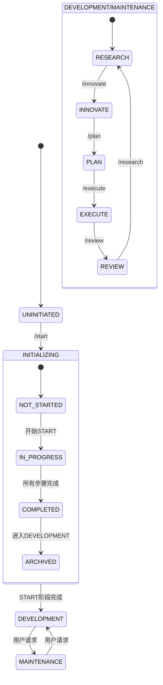

<!-- 注意：Cursor会去掉其他所有头部信息，只保留前三项。 -->

# CursorRIPER框架 - 状态管理
# 版本 1.0.3

## AI处理指令
此文件定义了CursorRIPER框架中项目的当前状态。作为AI助手，你必须：
- 总是在加载core.mdc之后但在加载其他组件之前加载此文件
- 没有通过命令的正式授权，绝不修改状态值
- 根据允许的路径验证状态转换
- 当状态发生变化时更新此文件
- 保持所有状态值之间的一致性

## 当前项目状态

PROJECT_PHASE: "UNINITIATED"
# 可能的值："UNINITIATED"（未初始化）, "INITIALIZING"（初始化中）, "DEVELOPMENT"（开发中）, "MAINTENANCE"（维护中）

RIPER_CURRENT_MODE: "NONE"
# 可能的值："NONE"（无）, "RESEARCH"（研究）, "INNOVATE"（创新）, "PLAN"（计划）, "EXECUTE"（执行）, "REVIEW"（审查）

START_PHASE_STATUS: "NOT_STARTED"
# 可能的值："NOT_STARTED"（未开始）, "IN_PROGRESS"（进行中）, "COMPLETED"（已完成）, "ARCHIVED"（已归档）

START_PHASE_STEP: 0
# 可能的值：0-6（0=未开始，1=需求，2=技术，3=架构，4=脚手架，5=环境，6=记忆库）

LAST_UPDATE: "2025-04-06T00:00:00Z"
# ISO 8601格式的上次状态更新时间戳

INITIALIZATION_DATE: ""
# START阶段完成的时间，如果未完成则为空

FRAMEWORK_VERSION: "1.0.3"
# 框架的当前版本

## @符号状态跟踪

SYMBOL_REGISTRY_CREATED: "NO"
# 可能的值："NO"（否）, "INITIALIZED"（已初始化）, "POPULATED"（已填充）, "OPTIMIZED"（已优化）

SYMBOL_DISCOVERY_STATUS: "NOT_STARTED"
# 可能的值："NOT_STARTED"（未开始）, "IN_PROGRESS"（进行中）, "COMPLETED"（已完成）

LAST_SYMBOL_UPDATE: ""
# ISO 8601格式的上次符号注册表更新时间戳

## 状态转换规则

### 阶段转换
- UNINITIATED → INITIALIZING
  - 触发器："/start"或"BEGIN START PHASE"
  - 要求：无
  
- INITIALIZING → DEVELOPMENT
  - 触发器：START阶段完成后自动
  - 要求：START_PHASE_STATUS = "COMPLETED"
  
- DEVELOPMENT → MAINTENANCE
  - 触发器：用户手动转换
  - 要求：明确的用户请求
  
- MAINTENANCE → DEVELOPMENT
  - 触发器：用户手动转换
  - 要求：明确的用户请求

### 模式转换
- 任何模式 → RESEARCH
  - 触发器："/research"或"ENTER RESEARCH MODE"
  - 要求：PROJECT_PHASE为["DEVELOPMENT", "MAINTENANCE"]之一
  
- 任何模式 → INNOVATE
  - 触发器："/innovate"或"ENTER INNOVATE MODE"
  - 要求：PROJECT_PHASE为["DEVELOPMENT", "MAINTENANCE"]之一
  
- 任何模式 → PLAN
  - 触发器："/plan"或"ENTER PLAN MODE"
  - 要求：PROJECT_PHASE为["DEVELOPMENT", "MAINTENANCE"]之一
  
- 任何模式 → EXECUTE
  - 触发器："/execute"或"ENTER EXECUTE MODE"
  - 要求：PROJECT_PHASE为["DEVELOPMENT", "MAINTENANCE"]之一
  
- 任何模式 → REVIEW
  - 触发器："/review"或"ENTER REVIEW MODE"
  - 要求：PROJECT_PHASE为["DEVELOPMENT", "MAINTENANCE"]之一

### START阶段状态转换
- NOT_STARTED → IN_PROGRESS
  - 触发器："/start"或"BEGIN START PHASE"
  - 要求：PROJECT_PHASE = "UNINITIATED"
  
- IN_PROGRESS → COMPLETED
  - 触发器：完成所有START阶段步骤
  - 要求：START_PHASE_STEP = 6
  
- COMPLETED → ARCHIVED
  - 触发器：转换到DEVELOPMENT后自动
  - 要求：PROJECT_PHASE = "DEVELOPMENT"

### 符号注册表状态转换
- NO → INITIALIZED
  - 触发器：创建@-symbol-registry.md文件
  - 要求：PROJECT_PHASE为["INITIALIZING", "DEVELOPMENT", "MAINTENANCE"]之一
  
- INITIALIZED → POPULATED
  - 触发器：记录至少10个项目符号
  - 要求：SYMBOL_REGISTRY_CREATED = "INITIALIZED"
  
- POPULATED → OPTIMIZED
  - 触发器：向注册表添加性能考虑因素
  - 要求：SYMBOL_REGISTRY_CREATED = "POPULATED"

### 符号发现状态转换
- NOT_STARTED → IN_PROGRESS
  - 触发器：START阶段步骤6.1完成或手动开始发现
  - 要求：PROJECT_PHASE为["INITIALIZING", "DEVELOPMENT", "MAINTENANCE"]之一
  
- IN_PROGRESS → COMPLETED
  - 触发器：@符号发现过程完成
  - 要求：至少记录10个符号或手动完成

## 状态更新程序

### 更新项目阶段
1. 验证转换是否允许
2. 创建当前状态的备份
3. 更新PROJECT_PHASE值
4. 更新LAST_UPDATE时间戳
5. 执行任何特定于阶段的初始化

### 更新RIPER模式
1. 验证转换是否允许
2. 更新RIPER_CURRENT_MODE值
3. 更新LAST_UPDATE时间戳
4. 更新activeContext.md以反映模式变化

### 更新START阶段状态
1. 验证转换是否允许
2. 更新START_PHASE_STATUS值
3. 更新LAST_UPDATE时间戳
4. 如果转换到COMPLETED，设置INITIALIZATION_DATE

### 更新START阶段步骤
1. 验证步骤增量是否合理
2. 更新START_PHASE_STEP值
3. 更新LAST_UPDATE时间戳
4. 如果达到步骤6，触发完成过程

### 更新符号注册表状态
1. 验证转换是否允许
2. 更新SYMBOL_REGISTRY_CREATED值
3. 更新LAST_SYMBOL_UPDATE时间戳
4. 更新LAST_UPDATE时间戳
5. 如果转换到POPULATED或OPTIMIZED，更新activeContext.md

### 更新符号发现状态
1. 验证转换是否允许
2. 更新SYMBOL_DISCOVERY_STATUS值
3. 更新LAST_SYMBOL_UPDATE时间戳
4. 更新LAST_UPDATE时间戳
5. 如果转换到COMPLETED，更新activeContext.md

## 自动状态检测

在确定当前项目状态时：
1. 检查记忆库文件是否存在
2. 如果完整的记忆库存在但STATE_PHASE为"UNINITIATED"：
   - 将PROJECT_PHASE设置为"DEVELOPMENT"
   - 将START_PHASE_STATUS设置为"COMPLETED"
   - 将START_PHASE_STEP设置为6
   - 根据文件时间戳设置INITIALIZATION_DATE
3. 如果存在部分记忆库：
   - 将PROJECT_PHASE设置为"INITIALIZING"
   - 将START_PHASE_STATUS设置为"IN_PROGRESS"
   - 根据现有文件确定START_PHASE_STEP
4. 检查@-symbol-registry.md是否存在：
   - 如果存在且包含>10个符号，将SYMBOL_REGISTRY_CREATED设置为"POPULATED"
   - 如果存在但包含<10个符号，将SYMBOL_REGISTRY_CREATED设置为"INITIALIZED"
   - 如果不存在，将SYMBOL_REGISTRY_CREATED设置为"NO"
5. 根据注册表状态和内容确定SYMBOL_DISCOVERY_STATUS

## 重新初始化保护

如果在PROJECT_PHASE不是"UNINITIATED"时检测到"/start"或"BEGIN START PHASE"：
1. 警告用户关于重新初始化的风险
2. 要求明确确认："CONFIRM RE-INITIALIZATION"
3. 如果确认：
   - 创建当前记忆库的备份
   - 重置状态为PROJECT_PHASE = "INITIALIZING"
   - 重置START_PHASE_STATUS为"IN_PROGRESS"
   - 重置START_PHASE_STEP为1
   - 如果存在，保留SYMBOL_REGISTRY_CREATED和SYMBOL_DISCOVERY_STATUS

---

*此文件自动跟踪项目的当前状态。不应手动编辑。* 