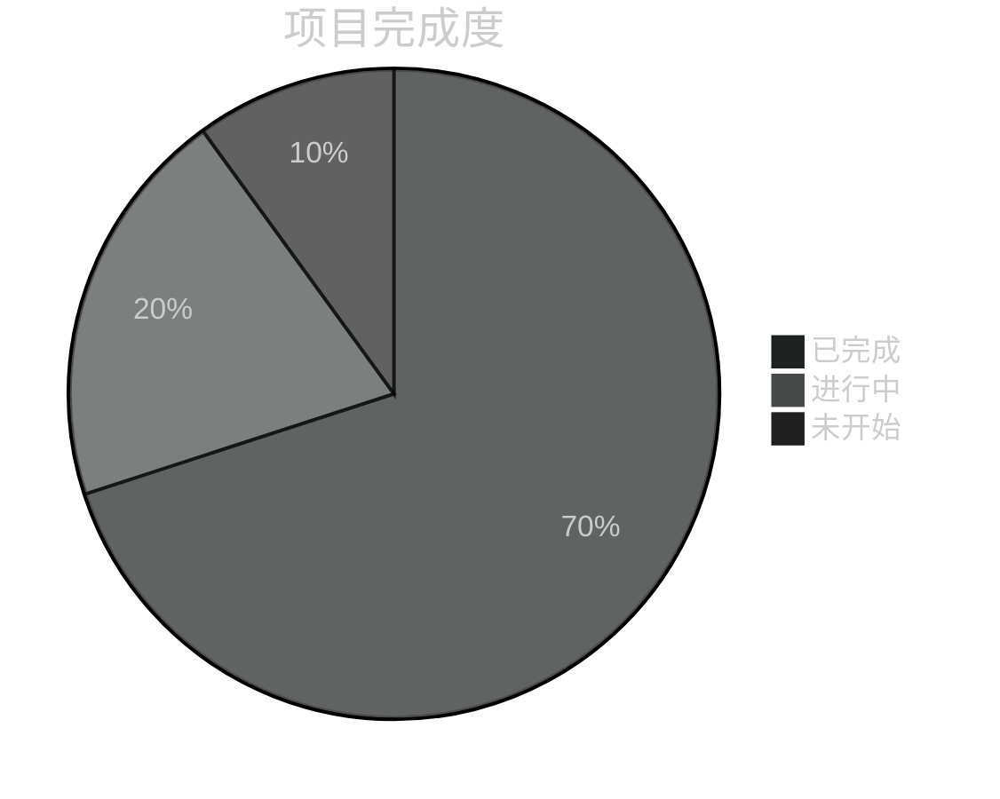

# 进度跟踪器：[项目名称]
*版本：1.0*
*创建日期：[当前日期]*
*最后更新：[当前日期]*

## 项目状态
总体完成度：[百分比]%

## 已完成功能
- [功能_1]：[完成状态] - [注释]
- [功能_2]：[完成状态] - [注释]
- [功能_3]：[完成状态] - [注释]

## 进行中功能
- [功能_4]：[进度百分比]% - [注释]
- [功能_5]：[进度百分比]% - [注释]
- [功能_6]：[进度百分比]% - [注释]

## 待构建功能
- [功能_7]：[优先级] - [注释]
- [功能_8]：[优先级] - [注释]
- [功能_9]：[优先级] - [注释]

## 已知问题
- [问题_1]：[严重程度] - [描述] - [状态]
- [问题_2]：[严重程度] - [描述] - [状态]
- [问题_3]：[严重程度] - [描述] - [状态]

## 里程碑
- [里程碑_1]：[截止日期] - [状态]
- [里程碑_2]：[截止日期] - [状态]
- [里程碑_3]：[截止日期] - [状态]

---

*此文档跟踪已完成功能、进行中功能和待构建功能。* 