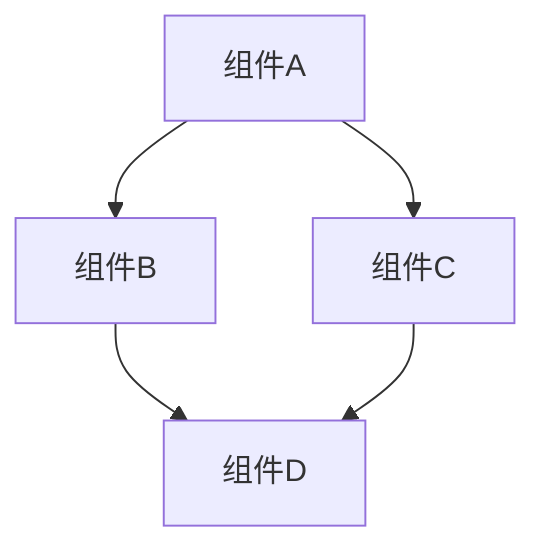
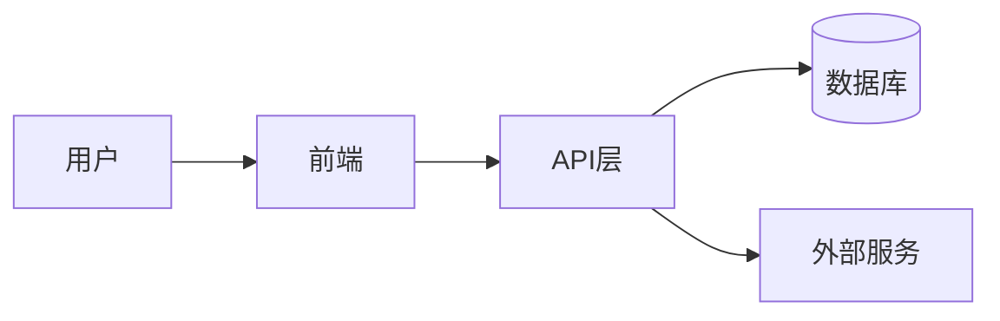

# 系统模式：[项目名称]
*版本：1.0*
*创建日期：[当前日期]*
*最后更新：[当前日期]*

## 架构概述
[系统架构的高级描述]

## 关键组件
- [组件_1]：[目的]
- [组件_2]：[目的]
- [组件_3]：[目的]

## 使用的设计模式
- [模式_1]：[使用上下文]
- [模式_2]：[使用上下文]
- [模式_3]：[使用上下文]

## 数据流
[数据如何在系统中流动的描述或图表]

## 关键技术决策
- [决策_1]：[理由]
- [决策_2]：[理由]
- [决策_3]：[理由]

## 组件关系
[组件之间如何相互作用的描述]

---

*此文档捕获了项目中使用的系统架构和设计模式。* 